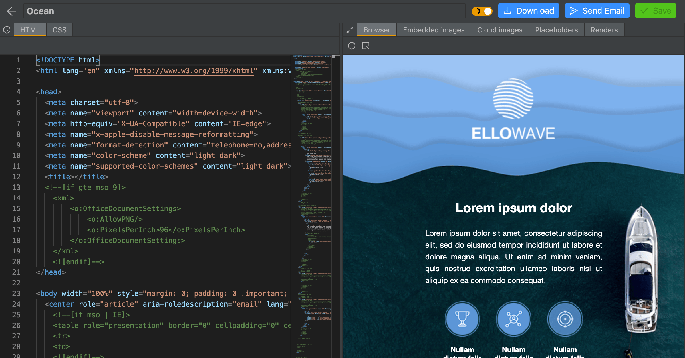

# Ed sharing

# Introduction

[https://github.com/vietphan1995/ed-sharing.git](https://github.com/vietphan1995/ed-sharing.git)

In the growing age of smart device, email template may growing follow many standards from variety of device screens. Ed sharing is a software platform act as email builder platform that helps people design and share email template.

Ed sharing supports best email template view in many device platforms, screen shapes, screen sizes. Ed sharing supports many ways to design email template, content parameters like drag and drop components to email view, plain email component code.

Ed sharing helps people share/contribute your designing email to others.

[back to projects …](https://github.com/vietphan1995/projects)

### Notes
https://six-zinc-ad4.notion.site/Ed-sharing-1b55e832d6ee80fda761fb086176db3d